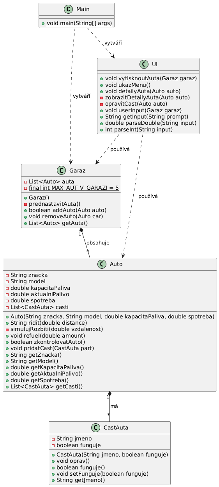

# Garage Management System

A Java-based console application demonstrating core Object-Oriented Programming (OOP) principles, designed to simulate a vehicle inventory and garage component management system.

> **Note:** This project was developed as an academic assignment. The codebase, variable nomenclature, user interface text, and console outputs are written in Czech according to curriculum specifications.

---

## Features

* **Vehicle Modeling:** Implements detailed structures for cars (`Auto`) composed of granular mechanical components (`CastAuta`).
* **Inventory Control:** Simulates a localized garage system (`Garaz`) capable of tracking, organizing, and managing multiple vehicle instances.
* **Interactive UI:** Features a text-based console menu layer (`UI`) handling user input and data presentation.
* **Architectural Blueprint:** Includes a structural UML class diagram (`UML.png`) mapping out object relationships and system inheritance.

---

## Architecture Overview

Below is the structural class diagram detailing the relationships between the system entities:



---

## Tech Stack & Core Concepts

* **Language:** Java (JDK 17+)
* **OOP Concepts:** Encapsulation, Composition (Car has Parts), and Collections management (`ArrayList`).

---

## Setup

To clone and run this application locally, execute the following commands in your terminal:

```bash
# Clone the repository
git clone [https://github.com/SolaraCZ/java-garage-manager.git](https://github.com/YOUR_GITHUB_USERNAME/java-garage-manager.git)

# Navigate to the source directory
cd java-garage-manager/autov3/src

# Compile the application
javac Main.java

# Run the application
java Main